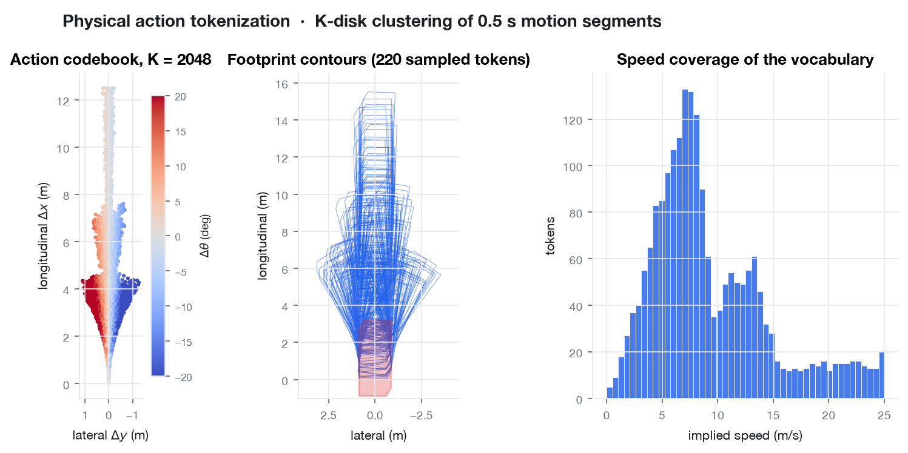
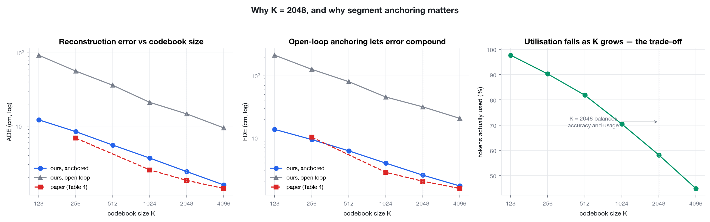

# AutoVLA — Phase I: data processing and visualisation

Reimplementation of the data layer of **AutoVLA: A Vision-Language-Action Model
for End-to-End Autonomous Driving with Adaptive Reasoning and Reinforcement
Fine-Tuning** (Zhou et al., 2025, [arXiv:2506.13757](https://arxiv.org/abs/2506.13757)).

**Team 5** · Raghul D (23BAI0034) · Sahithya D (23BAI0035) · Medha S (23BAI0039)
**BCSE332L Deep Learning** · Phase I Course Based Design Project · VIT

---

## What is here

Everything lives in **[`data_pipeline/`](data_pipeline/)**.

AutoVLA turns driving into next-token prediction: a 5-second trajectory becomes
ten discrete action tokens that a vision-language model emits in the same stream
as its reasoning. This repository builds the pipeline that produces those tokens.

```
raw driving logs
  → unified sample schema      (ego-frame trajectory, 3 cameras × 4 frames,
                                vehicle state, navigation instruction)
  → 0.5 s motion segments      (body-frame Δx, Δy, Δθ)
  → K-disk action codebook     (K = 2048 physically feasible motion primitives)
  → action tokenizer           (5 s trajectory ⇄ 10 discrete <action_i> tokens)
  → SFT chat records           (system prompt + observation + CoT + action tokens)
```

## Quick start

```bash
cd data_pipeline && python3 -m venv .venv && ./.venv/bin/pip install -r requirements.txt
```

```bash
./.venv/bin/python scripts/run_pipeline.py --n-traj 4000 --ablation
```

Roughly 90 seconds on a laptop. No GPU, no dataset download.

## Results against the paper

Tokenizer round-trip accuracy over 5 s trajectories, next to AutoVLA's Table 4:

| K | our ADE | paper ADE | our FDE | paper FDE |
|---:|---:|---:|---:|---:|
| 256 | 8.42 cm | 6.87 cm | 9.48 cm | 10.34 cm |
| 1024 | 3.67 cm | 2.53 cm | 3.96 cm | 2.82 cm |
| **2048** | **2.40 cm** | **1.82 cm** | **2.54 cm** | **2.03 cm** |
| 4096 | 1.58 cm | 1.41 cm | 1.70 cm | 1.55 cm |

Achieved covering radius **0.063 m** against the paper's stated δ = 0.05 m, and
**99.9%** of codebook tokens pass a kinematic bicycle-model feasibility check.

## Documentation

| Document | What it covers |
|---|---|
| [data_pipeline/README.md](data_pipeline/README.md) | Pipeline overview, figures, key parameters |
| [data_pipeline/docs/DATASET_AND_METHOD.md](data_pipeline/docs/DATASET_AND_METHOD.md) | Full dataset and method write-up, stage by stage |
| [data_pipeline/MILESTONES.md](data_pipeline/MILESTONES.md) | Workflow through GRPO fine-tuning, with owners and risks |

## Figures

Rendered into `data_pipeline/outputs/figures/` on every run.





## A note on the data

The committed results were produced from a **procedural stand-in corpus**, not
from nuScenes — the nuScenes archive requires accepting a licence and signing in,
so it is not downloaded here. The nuScenes adapter is written and tested; run
`--source nuscenes` once you have `v1.0-mini`. Nothing downstream of the adapter
changes. Statistics from the stand-in corpus are labelled as such throughout.

Large generated artifacts (`sft_train.jsonl`, `unified_samples.jsonl`, ~58 MB)
are not committed — regenerate them with `scripts/run_pipeline.py`.

## Status

Phase I (data processing and visualisation) is complete. Phase II — the
Qwen2.5-VL backbone, supervised fine-tuning, and GRPO reinforcement fine-tuning —
is planned in [MILESTONES.md](data_pipeline/MILESTONES.md).
